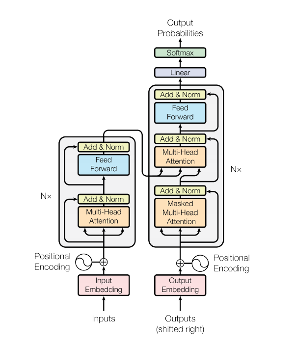
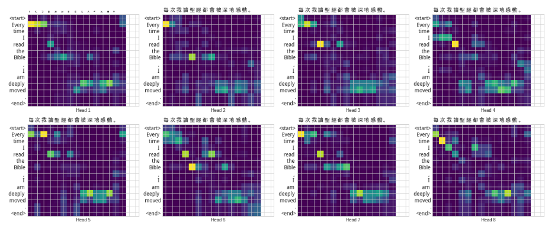

### Neural Machine Translation (*English to Chinese*) 

This neural machine translator is based on [**Transformer**](https://arxiv.org/abs/1706.03762) with Google STT and TTS

#### Usage

```
python3 interpret_en-zh.py
```

#### Download and prepare the dataset

The language dataset is provided by [Tab-delimited Bilingual Sentence Pairs from Anki](http://www.manythings.org/anki/). This dataset contains language translation pairs in the format:

```
It is impossible to master English in a short time.	不可能短時間內學會英語。
```

The English-Chinese dataset is used. After downloading the dataset, here are the steps to prepare the data:

1. Add a *start* and *end* token to each sentence.
2. Clean the sentences by removing special characters.
3. Create a word index and reverse word index (dictionaries mapping from word → id and id → word).
4. Pad each sentence to a maximum length.

#### Model architecture



#### Attention Map



#### Translation Results

* English sentence: It is impossible to master English in a short time.
* Chinese sentence: 不可能短時間內學會英語。
---
* English sentence: Fluency in English is a very marketable skill today.
* Chinese sentence: 流利的英語在今天是一種十分搶手的技能。
---
* English sentence: What's your favorite place to vacation in Japan?
* Chinese sentence: 你最喜歡去日本的什麼地方度假？
---
* English sentence: Can you tell me how to get to the train station?
* Chinese sentence: 你可以告訴我要怎麼去火車站嗎?
---
* English sentence: If it is fine tomorrow, we'll go on a picnic.
* Chinese sentence: 如果明天天氣好，我們就去野餐。
---
* English sentence: If it rains tomorrow, I'll just stay at home.
* Chinese sentence: 如果明天下雨，我就待在家。
---
* English sentence: Real friendship is more valuable than money.
* Chinese sentence: 真正的友誼比金錢更有價值。
---
* English sentence: It is more blessed to give than to receive.
* Chinese sentence: 贈與比接受更讓人覺得幸福。
---
* English sentence: It says in the Bible, 'Man shall not live on bread alone.'
* Chinese sentence: 聖經裡有一句話，叫做“人不能只靠麵包生活”。
---
* English sentence: Every time I read the Bible, I am deeply moved.
* Chinese sentence: 每次我讀聖經都會被深地感動。
---

#### See also
* [Transformer](https://youtu.be/ugWDIIOHtPA)
* [ELMO, BERT, GPT2](https://youtu.be/UYPa347-DdE)
* [My Video 1](https://www.linkedin.com/posts/joseph-huang-793541167_neural-machine-translation-with-transformer-activity-6608735481784045568-lH8k)
* [My Video 2](https://www.linkedin.com/posts/joseph-huang-793541167_neural-machine-translation-with-transformer-activity-6609418383911948288-ZCe6)
* [My Video 3](https://www.linkedin.com/posts/joseph-huang-793541167_neural-machine-translation-with-transformer-activity-6609420823235260416-Ezgi)
